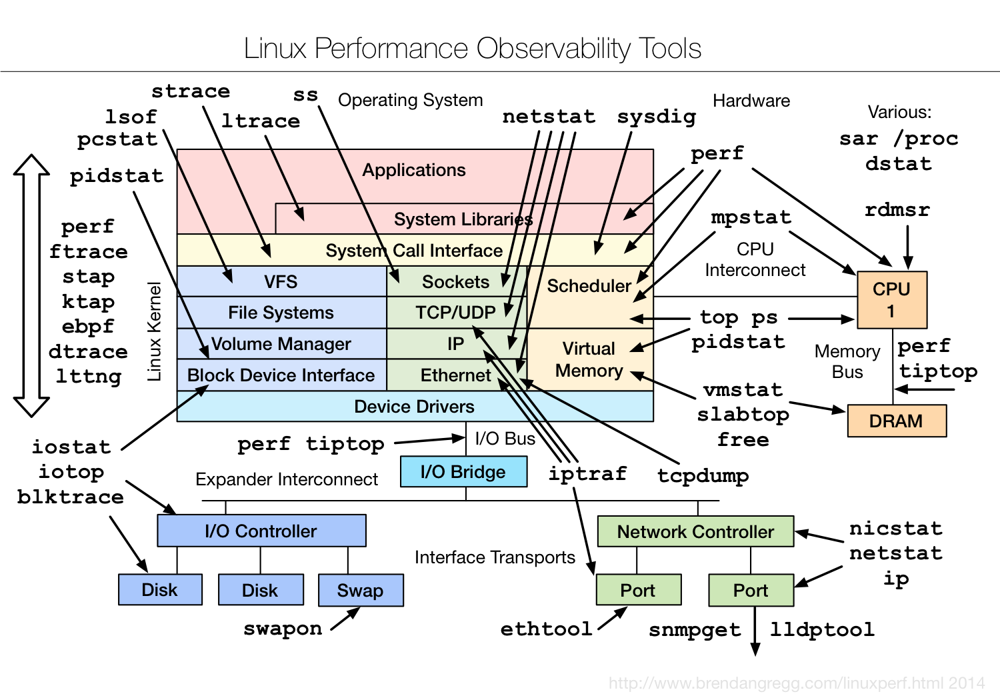
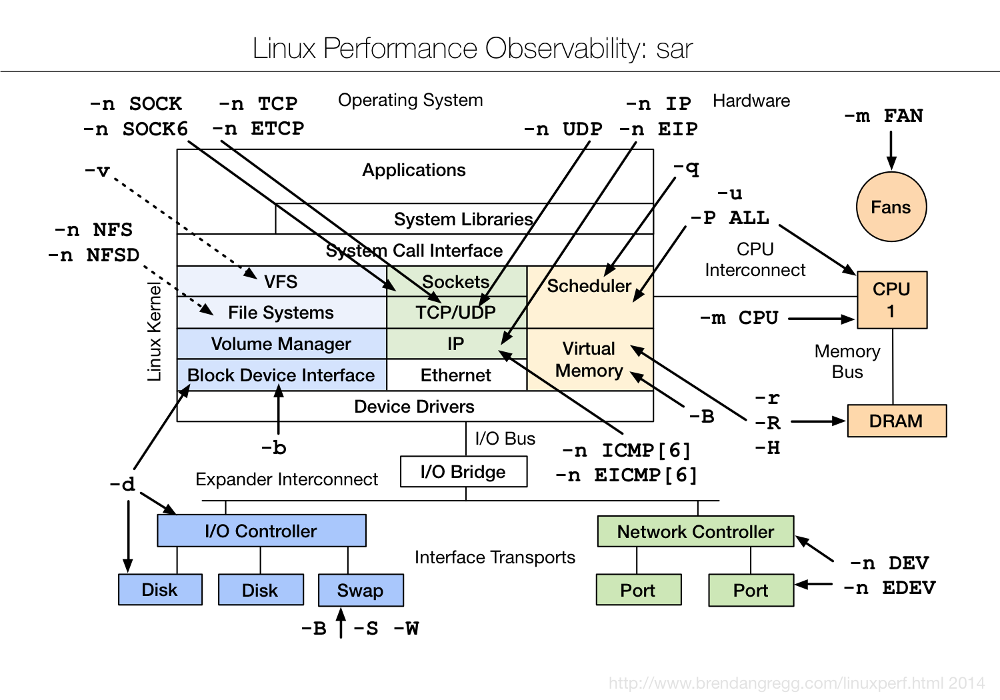
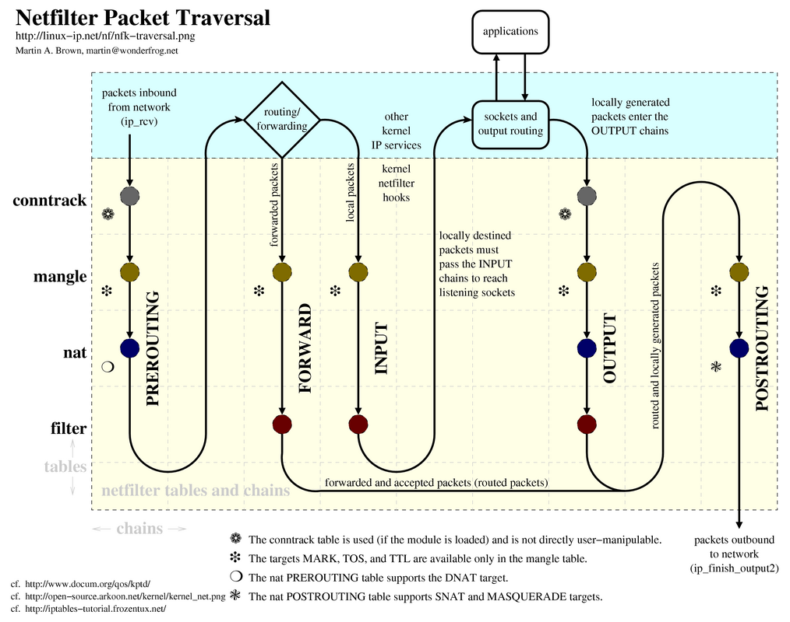

### 系統管理
1. 情境：計算硬碟上以/dev/開頭之filesystem剩餘空間

    ```bash
    指令：df | grep ^/dev/ | awk '{sum += $4} END {print sum " bytes left" }'
    ```
    

2. 情境：看資料夾結構

    ```bash
    指令：tree -d
    ```

    // 只列出資料夾 tree -L 2 只列出最多兩層

    

3. 情境：檢查特定service是否執行中

    ```bash
    指令：ps aux | grep -v grep | grep service_name
    ```

4. 情境：自訂時間戳記 (例如三個月前)

    ```bash
    指令：date --date='-3 month' +%Y-%m
    ```

    

5. 情境：自動將公鑰傳送至遠端機器並寫入相關設定

    ```bash
    指令：ssh-copy-id -i ~/.ssh/(identity | id_dsa.pub | id_rsa.pub) username@ip
    ```

6. 情境：查看shell環境

    ```bash
    指令一：ls -l `which sh`

    指令二：echo $SHELL

    指令三：env

    指令四：ps $$

    指令五：echo "$0"
    ```

7. 情境：檢查指令是否執行成功

    ```bash
    腳本一：

    ping -c 1 8.8.8.8

    # check if the ping command was successfully executed.
    # (0 means yes, 1 means no)

    if [ $? -eq 0 ]; then
        echo "successfully executed!" >> report.txt
    fi
    ```

    ```bash
    腳本二：

    # this one is shorter

    ping -c 1 8.8.8.8 && echo "successfully executed!" >> report.txt
    ```

8. 情境：列出當前目錄所有檔案容量

    ```bash
    指令：du -sh
    ```

9. 情境：持續觀察磁碟空間變化

    ```bash
    指令一：while true; do clear; df -h; sleep 3; done

    指令二：watch -n3 df -h
    ```

10. 情境：加入既有ssh private key

    ```bash
    指令：cp id* .ssh; eval `ssh-agent -s`; ssh-add
    ```

11. 情境：檢查是否以root身份執行

    ```bash
    腳本一：

    if [ "$UID" -ne "$ROOT_UID" ];
    then
        echo "執行身份非root"
    fi
    ```

    ```bash
    腳本二：

    if [ `whoami` != "root" ];
    then
        echo "I am not root"
    fi
    ```

12. 情境：找出 /var 目錄下最大檔案前十名

    ```bash
    指令：du -a /var | sort -n -r | head -n 10
    ```

13. 情境：列出所有已安裝套件

    ```bash
    指令一：dpkg --get-selections > inistalled_packages.txt (for debian)

    指令二：rpm -qa > inistalled_packages.txt (for fedora or centos)
    ```

14. 情境：使得某些特定ip透過特定gw出去

    ```bash
    腳本一：

    arr=("ip1" "ip2")
    for i in ${arr[*]}
    do
        route add -host $i gw ip
    done
    ```

    ```bash
    腳本二：
    ```

    [ishadm](tools/ishadm)

    ```bash
    指令：route add -net x.x.x.x netmask x.x.x.x gw x.x.x.x
    ```

15. 情境：ls 列出的檔名需要跳脫(escape)時，自動幫你用引號包起來

    ```bash
    指令：ls --quoting-style=shell

    // 結果例如： (可以 man ls 查看更多 style)
    // '!this$file%contain&control(characters)~'  'this file contain whitespace char'  tmp.txt
    ```

16. 情境：查看CPU核心數 (連 Intel HT 超執行緒技術所虛擬成兩倍個數也算在內)

    ```bash
    指令一：grep -c ^processor /proc/cpuinfo

    指令二：grep -Ec '^cpu[0-9]+ ' /proc/stat

    // 常用來搭配 make 指令，寫在 shell script 中使用，以利加速建置。
    ```

    ```bash
    腳本：

    cpu_cores="$(grep -c ^processor /proc/cpuinfo)"
    make -j$(cpu_cores)
    ```

17. 情境：釋出記憶體快取空間

    ```bash
    指令：sync; sudo sysctl vm.drop_caches={1, 2, 3, 4}

    // 1 -> pagecache
    // 2 -> slab cache
    // 3 -> pagecache & slab cache
    // 4 -> disable

    // 詳見 https://www.kernel.org/doc/Documentation/sysctl/vm.txt
    ```

18. 情境：使用ls列出最新的檔名列在最下面

    ```bash
    指令：ls -sort
    ```

19. 切換該terminal的訊息顯示語言為英文 (非永久變更，僅限該登入session)

    ```bash
    指令：export LC_ALL=C;LANG=C;LANGUAGE=en_US

    // 輸入locale進行確認：

    $ locale
    LANG=C
    LANGUAGE=en_US
    LC_CTYPE="C"
    LC_NUMERIC="C"
    LC_TIME="C"
    LC_COLLATE="C"
    LC_MONETARY="C"
    LC_MESSAGES="C"
    LC_PAPER="C"
    LC_NAME="C"
    LC_ADDRESS="C"
    LC_TELEPHONE="C"
    LC_MEASUREMENT="C"
    LC_IDENTIFICATION="C"
    LC_ALL=C
    ```

20. 情境：用sudo執行上一個指令

    ```bash
    指令：sudo !!
    ```

21. 情境：檢查 iptables log 是否有持續收錄

    ```bash
    腳本：

    NO_LOG=0
    NOWLOGS=$(grep iptables /var/log/messages| wc -l)
    PASTLOGS=$(cat n_of_log)

    if [ $NOWLOGS == $NO_LOG ]; then
        echo "no business today"

    elif [ $NOWLOGS -eq $PASTLOGS ]; then
        echo "no business during checking points"

    elif [ $NOWLOGS -gt $PASTLOGS ]; then
        echo "New logs logged"
        echo "$NOWLOGS" > n_of_log

    else
        echo "refresh n_of_log"
        echo "$NOWLOGS" > n_of_log

    fi
    ```

22. 情境：檔案若使用git進行版本控制，檔案進行修改後，可使用指令產生patch，後續可在其他的git repositary 加入patch檔的修正

    ```bash
    指令：git diff commit1 commit 2 > foo.patch
    ```

    

23. 情境：以SSH登入時出現「WARNING: REMOTE HOST IDENTIFICATION HAS CHANGED!」

    ```bash
    指令：ssh-keygen -R 伺服器端的IP或網址
    ```

24. 情境：用 date 將人類可讀的日期、時間 <-> unix time

    ```bash
    # unix time -> 人類可讀的日期、時間
    指令一：date -d @timestamp

    # 人類可讀的日期、時間 -> unix time
    指令二：date +%s --date='2015-01-01'
    ```

25. 情境：用 chsh 更改 shell 環境

    ```bash
    # 先用 cat /etc/shells 查看有哪些 shell 環境

    指令：chsh -s /etc/bash
    # 執行後，重新 login
    # 用 ps $$ 查看 shell 環境是否改變
    ```

26. 情境：bash 變數索引表

    ```bash
    # 印出 bash 版本
    echo $BASH_VERSION

    # 印出 hostname
    echo $HOSTNAME

    # 印出 CDPATH 設定
    echo $CDPATH

    # 印出分隔字元
    echo $IFS

    # 印出執行擋路徑
    echo $PATH

    # 印出等待秒數
    #（如 $TMOUT 是 300 秒，
    # 若使用者超過三百秒沒跟 bash 互動
    # 則自動登出。）
    echo $TMOUT
    ```

27. 情境：讓 history 顯示時間戳記

    ```bash
    指令：export HISTTIMEFORMAT="%F %T "
    ```

28. 情境：多個 inter active bash 存在時，讓 history 不會彼此 overwrite

    ```bash
    指令：shopt -s histappend
    ```

29. 情境：協助 bash 腳本 debug

    ```bash
    # 腳本有錯立刻停止
    set -e

    # 顯示腳本執行進度
    set -x
    ```

30. 情境：以更彈性的方式操作 date 指令的輸出

    ```bash
    set `date`
    echo $1 $6

    # 假設 date 輸出是 Tue Feb 10 09:00:52 CST 2015
    # 則 echo $1 $6 輸出為
    Tue 2015
    ```

31. 情境：Linux 效能觀察相關工具查閱表

    

32. 情境：Linux 效能觀察參數查閱表 (以sar工具來觀察)

    

33. 情境：Linux 效能測試相關工具查閱表

    

34. 情境：Linux 效能調校相關工具查閱表

    


35. 情境：netfilter packet 遊歷表

    

36. 情境：子網路遮罩計算機

    ```bash
    指令一：sipcalc 192.168.100.0/24

    輸出結果：

    -[ipv4 : 192.168.100.0/24] - 0

    [CIDR]
    Host address        - 192.168.100.0
    Host address (decimal)  - 3232261120
    Host address (hex)  - C0A86400
    Network address     - 192.168.100.0
    Network mask        - 255.255.255.0
    Network mask (bits) - 24
    Network mask (hex)  - FFFFFF00
    Broadcast address   - 192.168.100.255
    Cisco wildcard      - 0.0.0.255
    Addresses in network    - 256
    Network range       - 192.168.100.0 - 192.168.100.255
    Usable range        - 192.168.100.1 - 192.168.100.254

    指令二：whatmask 192.168.100.0/24

    ------------------------------------------------
               TCP/IP NETWORK INFORMATION
    ------------------------------------------------
    IP Entered = ..................: 192.168.100.0
    CIDR = ........................: /24
    Netmask = .....................: 255.255.255.0
    Netmask (hex) = ...............: 0xffffff00
    Wildcard Bits = ...............: 0.0.0.255
    ------------------------------------------------
    Network Address = .............: 192.168.100.0
    Broadcast Address = ...........: 192.168.100.255
    Usable IP Addresses = .........: 254
    First Usable IP Address = .....: 192.168.100.1
    Last Usable IP Address = ......: 192.168.100.254
    ```

37. 情境：以 sshfs mount 遠端 server 的 filesystem

    ```bash
    # 將遠端主機 IP 為 192.168.1.123 的 /root/ 目錄掛載到 /mnt/server1 目錄下
    指令一：sudo sshfs root@192.168.1.123:/ /mnt/server1/
    ```

38. 情境：設定 alias，使其 ssh 連線到須透過特定 gw 的機器前先做檢查

    ```bash
    # 將以下寫入 .bashrc 中
    gw=$(sudo route -n|grep -o -E '(gw1_IP|gw2_IP)')

    指令一：alias connect2remote="if [ $gw == "gw1_IP" ]; then ssh username@ip; else echo 'wrong gw'; fi"
    指令二：alias connect2remote="[ $gw == "gw1_IP" ] && ssh username@ip || echo 'wrong gw!'"
    ```

39. 情境：查詢外部 (WAN) ip

    ```bash
    指令一：curl ifconfig.me/ip
    指令二：wget -qO- ifconfig.me/ip

    #   ifconfig.me/ip 可替換成下列任一個
        whatismyip.org
        icanhazip.com
        tnx.nl/ip
        myip.dnsomatic.com
        ip.appspot.com
        checkip.dyndns.org:8245
        whatismyip.com
        jsonip.com
    ```

40. 情境：間隔 n 分鐘後關機

    ```bash
    指令：shutdown -h +n
    ```

    ```bash
    腳本一：
    # n 分鐘後關機
    $ bash countdown n

    The system will be shutdown in 5 minutes
    Shutting down in 5 minutes
    Shutting down in 4 minutes
    Shutting down in 3 minutes
    Shutting down in 2 minutes
    Shutting down in 1 minutes
    SEE YA~
    ```
    [countdown](tools/countdown)

    ```bash
    腳本二：
    # 十分鐘內關機
    $ rshutdown -g600

    Shutdown started.    Thu Dec  2 18:26:58 EST 2004

    The system mars will be shutdown in 10 minutes
    The system mars will be shutdown in 9 minutes
    The system mars will be shutdown in 8 minutes
    The system mars will be shutdown in 4 minutes
    THE SYSTEM mars IS BEING SHUT DOWN NOW ! ! !
    ```
    [rshutdown](tools/rshutdown)

41. 情境：一主機雙網卡

    ```bash
    腳本：

    # 設定第一個 subnet 的路由表 (表名稱命名為70)
    ip route flush table 70
    ip route add to 172.70.12.0/23 dev eth0 table 70
    ip route add to default via 172.70.12.1 dev eth0 table 70

    # 設定第二個 subnet 的路由表 (表名稱命名為80)
    ip route flush table 80
    ip route add to 172.80.24.0/23 dev eth1 table 80
    ip route add to default via 172.80.24.1 dev eth1 table 80

    # 建立路由表選取的規則。依據 source IP 來選擇。
    # 每一條規則都需要給 priority 值，方便起見就給予路由表名。
    ip rule add from 172.70.12.0/23 table 70 priority 70
    ip rule add from 172.80.24.0/23 table 80 priority 80

    # 清空 route cache
    ip route flush cache
    ```

42. 情境：切換使用者

    ```bash
    $ su <user>

    切換使用者 ID。

    假設有兩使用者 ID (A, B)。
    以 A ID 輸入 su B 後，則會切換至 B ID。

    若以 A ID 輸入 su B --preserve-environment 後，一樣會切換至 B ID。
    但profile, .bashrc 等環境參數還是會持續使用 A ID 的設定。

    $ sudo su <user>

    以 root 身份執行 su <user>。與 su <user> 差別在於執行指令後，
    輸入之密碼不同。

    例如：
    以 A ID 輸入 su B，則輸入 B ID 密碼後，即切換至 B ID。
    以 A ID 輸入 sudo su B，則輸入 A ID 密碼後，即切換至 B ID。

    $ sudo su -

    切換至 root 且使用 root 的環境設定。

    sudo 配置

    使用者帳號  登入者的來源主機名稱=(可切換的身份 user:group)  可下達的指令
    root                        ALL =(ALL:ALL)                  ALL   <==這是預設值
    ```

43. 情境：返回前一個目錄

    ```bash
    指令：cd $OLDPWD
    ```

44. 情境：Ubuntu 移除沒用到的 kernel 與 header

    ```bash
    指令：sudo apt-get purge $(dpkg -l linux-{image,headers}-"[0-9]*" | awk '/ii/{print $2}' | grep -ve "$(uname -r | sed -r 's/-[a-z]+//')")
    ```


### 檔案編輯
1. 情境：去除檔案中惱人的^M符號。(注意，^M要打ctrl+v及ctrl+m才會出現。)

    ```bash
    指令一：sed -i -e 's/^M//g' file

    指令二：dos2unix file

    // 這個符號多半是因為Windows上面編輯的檔案移到Unix系統上在編輯的時候會遇到，使用 dos2unix 可以直接轉換。

    指令三：perl -p -i -e 's/\r\n$/\n/g' my_file.txt

    指令四：若已經用 vim 開啟的話，可執行下列指令於 vim 裡：

    // 參考 [File format - Vim Tips Wiki](http://vim.wikia.com/wiki/File_format)

    :update            # 存儲任何修改。
    :e ++ff=dos        # 強制以 DOS 檔案格式，重新編輯檔案。
    :setlocal ff=unix  # 設定此 buffer 將只會以 LF 換行字元 (UNIX 檔案格式) 來寫入檔案。
    :w                 # 以 UNIX 檔案格式將  buffer 寫入檔案。
    ```

2. 情境：字串結合、調整

    ```bash
    指令：echo {{1,2,3}1,2,3}
    ```

3. 情境：字串結合、調整

    ```bash
    指令：echo fi{one,two,red,blue}sh
    ```

4. 情境：在檔案第一行插入字串（例如csv檔要加表格名稱）

    ```bash
    指令：(echo -n '<added text>\n'; cat test) > new_test
    ```

5. 情境：大量改檔案編碼(big5 -> utf-8)

    ```bash
    指令：convmv -r -f <from> -t <to> dir/

    // 遞迴改（不是真改）

    指令：convmv -r -f --notest -f <from> -t <to> dir/

    // 遞迴改（真改）
    ```

6. 情境：一次用grep查詢2個以上關鍵字

    ```bash
    指令：grep -E '(foo|bar)'
    ```

7. 情境：字串全部自動改成大(小)寫

    ```bash
    指令一：echo TeSt | awk '{ print toupper($_) }'

    // 全改大寫

    指令二：echo TeSt | awk '{ print tolower($_) }'

    // 全改小寫
    ```

8. 情境：遞迴搜尋資料夾，但是忽略符合格式的檔案(例如 `*.pyc`)

    ```bash
    指令：grep -r keyword --exclude '*.pyc' target_folder/

    // 範例：grep -r "import os" --exclude '*.pyc' my_project/
    ```

9. 情境：迅速撈出檔案中的特定行數

    例如：迅速撈出第 16 行內容

    ```bash
    指令一：nl index.html | grep "^\s*16" | head -n 1
    指令二：sed -n 16p index.html
    ```

10. 情境：以「,」來斷字

    ```bash
    腳本：

    #!/bin/bash
    IFS=$','
    vals='/mnt,/var,/dev,/tmp,/Virtual Machines'
    for i in $vals; do echo $i; done
    unset IFS
    ```

11. 情境：字串處理訣竅

    ```bash
    # 變數/參數若無值則給予值 (適用於positional parameter)
    ${var:-defaultValue}

    # 變數/參數若無值則給予值 (不適用於 positional parameter)
    ${var:=defaultValue}

    # 變數/參數若無值則跳錯誤訊息
    ${var:?"error_msg"}

    # 計算變數/參數字串長度
    ${#var}

    # 刪除字串後半部符合 pattern 的部分 (shortest)
    ${var%pattern}

    # 刪除字串後半部符合 pattern 的部分 (longest)
    ${var%%pattern}

    # 顯示子字串(由左到右從第n個開始連續m個，n m 皆為數字)
    ${var:n:m}

    # 刪除字串前半部符合 pattern 的部分 (shortest)
    ${var#pattern}

    # 刪除字串後半部符合 pattern 的部分 (longest)
    ${var##pattern}

    # 替換字串中符合 pattern 的部分
    # 若字串中有多個地方符合 pattern 則只會替換第一個找到的 pattern
    ${var/pattern/string}

    # 替換字串中所有符合 pattern 的部分
    ${var//pattern/string}
    ```

12. 情境：將檔案中重複的行，印出來

    ```
    sort duplicates.txt |uniq -d
    ```

13. 情境：漂亮排版

    ```bash
    指令：alias pp="column -s ';' -t"

    輸出結果(未使用 pp)：
    $ cat test.txt
    1;John
    3;Mary

    輸出結果(使用 pp)：
    cat test.txt|pp
    1  John
    3  Mary
    ```

### 檔案處理
1. 情境：大量改檔案名稱，並且遞增檔案id

    ```bash
    指令：ls | awk '{print "mv "$1" "NR".txt"}' | sh
    ```

2. 情境：大量改檔案名稱，取代檔案名稱中的某些字串(例如拿掉副檔名)

    ```bash
    指令：rename 's/\.bak$//' *.bak
    ```

3. 情境：大量改檔案名稱，大寫換小寫

    ```bash
    指令：rename 'y/A-Z/a-z/' *
    ```

4. 情境：將目錄中所有檔案逐一處理（檔案名稱無規則性）

    ```bash
    腳本：上面這個方法萬一資料夾裡面還有資料夾，可能就不符合預期行為。

    for file in $(ls folder)
    do
        python utils/submit.py folder/$file
    done
    ```

    ```bash
    指令：find folder -type f -maxdepth=1 -exec CMD ‘{}’ \;
    ```

5. 情境：大檔案切割，切成多個小檔案

    ```bash
    指令：split --bytes=1024m bigfile.iso file_prefix_
    ```

6. 情境：結合小檔案變成大檔案

    ```bash
    指令：cat small_file_* > joined_file.iso
    ```

7. 情境：顯示目錄底下資料夾大小並排序

    ```bash
    指令一：du -B K /dir --max-depth=1 | sort -g    //KB為單位

    指令一：du -B M /dir --max-depth=1 | sort -g    //MB為單位

    指令一：du -B G /dir --max-depth=1 | sort -g    //GB為單位

    指令二：for i in G M K; do du -ah | grep [0-9]$i | sort -nr -k 1; done | head -n 11
    ```

8. 情境： 將目錄下所有的檔案製作MD5(遞迴走訪)

    ```bash
    指令：find . -type f -exec md5sum {} \;
    ```

9. 情境：創建1M的空白檔案(內容全部填0)

    ```bash
    指令：dd if=/dev/zero of=test.img bs=1M count=1

    // 檢查

    $ hexdump -C test.img
    00000000  00 00 00 00 00 00 00 00  00 00 00 00 00 00 00 00  |................|
    *
    00100000
    ```

10. 情境：將1.png ~ 10.png 更名為001.png ~ 010.png

    ```bash
    指令：$ for i in `seq 1 10`; do mv $i.png `printf "%03d" $i`.png; done
    ```

11. 情境：將檔案名稱中空白部分以底線取代

    ```bash
    指令：rename 'y/ /_/' *
    ```

12. 情境：將 MySQL 資料庫內容輸出至 csv 檔

    ```bash
    指令：mysql -u username -p -B -e "show columns from table;" | sed "s/'/\'/;s/\t/\",\"/g;s/^/\"/;s/$/\"/;s/\n//g" >> test.csv
    ```

13. 情境：快速備份檔案

    ```bash
    腳本：請直接加在 .bashrc 中，並執行 source ~/.bashrc。

    function backup()
    {
        cp $1 $1.bak
    }

    # 使用方法：$ backup file.sh
    # 執行結果：產出 file.sh.bak 檔

    ```

14. 情境：懶人解壓縮法

    ```bash
    腳本：請直接加在 .bashrc 中，並執行 source ~/.bashrc。

    function extract()      # Handy Extract Program
    {
        if [ -f $1 ] ; then
            case $1 in
                *.tar.bz2)   tar xvjf $1     ;;
                *.tar.gz)    tar xvzf $1     ;;
                *.bz2)       bunzip2 $1      ;;
                *.rar)       unrar x $1      ;;
                *.gz)        gunzip $1       ;;
                *.tar)       tar xvf $1      ;;
                *.tbz2)      tar xvjf $1     ;;
                *.tgz)       tar xvzf $1     ;;
                *.zip)       unzip $1        ;;
                *.Z)         uncompress $1   ;;
                *.7z)        7z x $1         ;;
                *)           echo "'$1' cannot be extracted via >extract<" ;;
            esac
        else
            echo "'$1' is not a valid file!"
        fi
    }

    # 使用方法：$ extract file.壓縮檔副檔名

    ```

15. 情境：取得符號連結 (symlink; symbolic link) 最終所指向的檔案之完整路徑

    ```bash
    # 例如：取得系統安裝的 java 路徑。

    指令一：readlink -f "$(which java)"

    指令二：realpath "$(which java)"
    # 需額外灌一個套件 "realpath"

    指令三：python -c "import os; print os.path.realpath('$(which java)')"

    # 以上三個輸出結果皆為：
    # /usr/lib/jvm/java-7-openjdk-amd64/jre/bin/java

    指令四：namei -x "$(which java)"
    # 輸出結果：
    # f: /usr/bin/java
    #  D /
    #  d usr
    #  d bin
    #  l java -> /etc/alternatives/java
    #    D /
    #    d etc
    #    d alternatives
    #    l java -> /usr/lib/jvm/java-7-openjdk-amd64/jre/bin/java
    #      D /
    #      d usr
    #      d lib
    #      d jvm
    #      d java-7-openjdk-amd64
    #      d jre
    #      d bin
    #      - java
    ```

16. 以 python 實作 bash 函式
    ```bash
    function pipe_func_in_py() {

    python -c "$(cat <<EOPY
    import sys
    for line in sys.stdin:
        print ( "%s" % ( line.rjust(25) ) )
    EOPY
    )"

    }

    ```

17. 以 wget 抓取整個網站
    ```bash
    $ wget --recursive --no-clobber --page-requisites --html-extension --convert-links --restrict-file-names=windows url
    --recursive: download the entire Web site.
    --domains example.org: don’t follow links outside website.org.
    --no-parent: don’t follow links outside the directory manual/install/.
    --page-requisites: get all the elements that compose the page (images, CSS and so on).
    --html-extension: save files with the .html extension.
    --convert-links: convert links so that they work locally, off-line.
    --restrict-file-names=windows: modify filenames so that they will work in Windows as well.
    --no-clobber: don’t overwrite any existing files (used in case the download is interrupted and resumed).
    -e robots=off: ignore robots.txt
    ```
